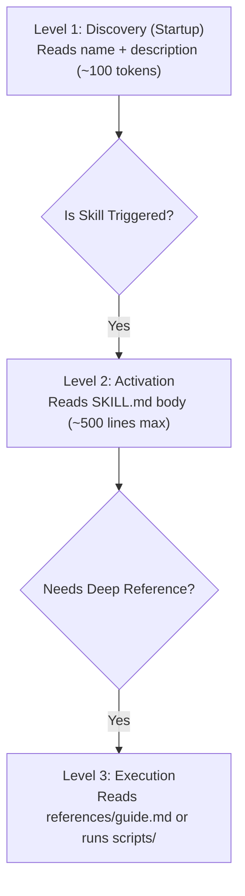

# Agent Skills Reference & Authoritative Compliance Guide

**Location:** `portfolio-prompts/references/guide.md`  
**Specification Reference:** [https://agentskills.io/specification](https://agentskills.io/specification)  
**Target:** Skill developers, maintainers, and autonomous AI agents.

---

## 1. Executive Summary

This guide provides the exhaustive technical reference for building, validating, and maintaining Agent Skills in compliance with the open **Agent Skills specification** ([https://agentskills.io/specification](https://agentskills.io/specification)).

It details the directory layouts, YAML frontmatter constraints, progressive disclosure mechanics, and validation rules required across the portfolio.

---

## 2. Agent Skills Directory Layout & Standard Structural Conventions

An Agent Skill is a self-contained directory under `skills/` containing at minimum a `SKILL.md` file.

```text
skills/
└── <skill-name>/
    ├── SKILL.md          # REQUIRED: Primary entrypoint (YAML frontmatter + Markdown)
    ├── scripts/          # OPTIONAL: Helper scripts executed by agents (Python, JS, Shell)
    ├── references/       # OPTIONAL: Deep reference documentation (loaded on-demand)
    │   └── guide.md      # Reference documentation for Level 3 progressive disclosure
    └── assets/           # OPTIONAL: Templates, static schemas, and resource files
```

### 2.1 File & Directory Placement Rules
- **Skill Entrypoint:** Must be located at `skills/<skill-name>/SKILL.md`.
- **Reference Material:** Detailed guides, API specifications, and extended documentation MUST be placed in `references/` (e.g. `references/guide.md`) or linked via relative paths to avoid bloating the primary `SKILL.md` file.
- **Executable Utilities:** Deterministic script actions should be located in `scripts/` (e.g. `scripts/validate-skill.js`).

---

## 3. Specification Constraints & Rules

### 3.1 Skill Identifier (`name`)
The `name` field in `SKILL.md` frontmatter defines the skill identifier.

1. **Format:** Lowercase ASCII letters (`a-z`), numbers (`0-9`), and hyphens (`-`) ONLY.
   - ❌ No uppercase characters (`A-Z`)
   - ❌ No underscores (`_`), spaces, or dots (`.`)
   - ❌ No leading (`-skill`), trailing (`skill-`), or consecutive (`skill--name`) hyphens
2. **Length:** 1 to 64 characters.
3. **Directory Parity (CRITICAL):** The `name` string MUST match the parent directory name EXACTLY.
   - Example: `skills/derive-worklist/SKILL.md` must set `name: derive-worklist`.

---

### 3.2 Frontmatter Schema

`SKILL.md` MUST begin on Line 1 with `---` and close frontmatter with `---`.

```yaml
---
name: derive-worklist
description: Formally derives WORKLIST_{PROJECT}.md at portfolio root without actioning code changes. Triggers when asked to derive worklist, prepare worklist, or run derive-worklist prompt.
license: Apache-2.0
compatibility: Requires git, gh CLI, and Node.js >= 20.
metadata:
  version: "1.0.0"
  category: "orchestration"
---
```

#### Allowed Top-Level Fields

| Field | Required | Type | Max Length | Description |
|---|---|---|---|---|
| `name` | **Yes** | String | 64 chars | Unique identifier matching directory name. |
| `description` | **Yes** | String | 1024 chars | Clear description of capability AND activation triggers. |
| `license` | No | String | Short | License identifier (e.g. `Apache-2.0`, `MIT`). |
| `compatibility` | No | String | 500 chars | System requirements, OS/tool dependencies. |
| `metadata` | No | Map | Arbitrary | Custom client metadata (key-value string map). |
| `allowed-tools` | No | String | Short | Space-separated pre-approved tool list. |

> [!WARNING]
> **No Custom Top-Level Keys:** Do not insert custom top-level YAML keys. Store all custom extension attributes under `metadata:`.

---

## 4. Three-Level Progressive Disclosure Architecture

To optimize context window usage and model reasoning efficiency, skills MUST adhere to three levels of progressive disclosure:



1. **Level 1 (Discovery):** Agent loads `name` and `description` at startup (~100 tokens).
2. **Level 2 (Activation):** Agent loads full `SKILL.md` body when user request matches the activation triggers. Keep `SKILL.md` under 500 lines.
3. **Level 3 (Execution):** Agent loads deep reference files (e.g. `references/guide.md`) or executes scripts in `scripts/` only when performing complex tasks.

---

## 5. Audit Checklist for Skill Authors

Before submitting a new or updated skill:

- [ ] Directory name is `skills/<skill-name>/` (lowercase, hyphens only).
- [ ] `SKILL.md` starts on Line 1 with YAML `---`.
- [ ] `name:` matches the parent directory name exactly.
- [ ] `description:` explicitly states **what** the skill does and **when** to activate it (<= 1024 chars).
- [ ] No unrecognised top-level keys in YAML frontmatter.
- [ ] Deep guides and heavy documentation are placed in `references/guide.md` or linked prompts.
